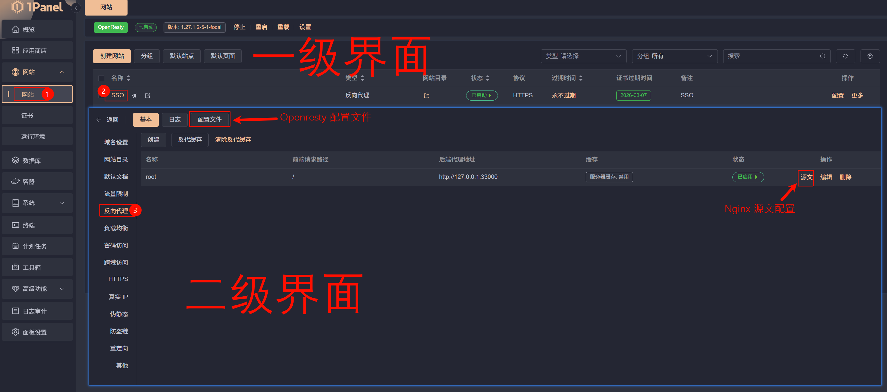

# Actions Derp China

> [!NOTE]
> GitHub Actions 工作流定时在北京时间每周一 00:00 自动追踪并在构建镜像后推送到 GitHub Packages 中

本项目使用 GitHub Actions 工作流自动构建 本库与 [lansepeach/Derp-China-new](https://github.com/lansepeach/Derp-China-new) 的镜像，免去本地构建环节。

---

## 前言

实验性项目，用来玩 Actions 的，虽然最后是玩 AI（笑

暂时不建议用 `derpin-china`，打包出来的镜像大了一倍，对小水管来说要命。  
当然你要用我也没法拦你，毕竟这个镜像目测来看不需要折腾一堆太多，填个 KEY，做个反代，拉起容器，最后在后台填下配置完事了。

比较适合不在服务器上用 Tailscale，只是打算做 derp 且需要用域名的需求。

不过结合 [如何强制 Tailscale 走 Derp 中转](https://linux.do/t/topic/752216) ，倒是可以试试（笑），等个有缘人反馈效果如何。

建议使用 Peer Relay 作为中继方案，详见 [Tailscale Peer Relay 让内网穿透更加稳定！](https://linux.do/t/topic/1330145)，Derp 作为保底。

---

> [!IMPORTANT]
> 使用 Tailscale 版本号作为对应构建镜像的版本号，当 Tailscale 更新版本后，在下周一自动更新并推送

## 镜像说明与版本说明

修改了 `Dockerfile` 所使用的系统，用于追踪最新的 Tailscale ，缺点是镜像大小会增加。  
将 `@main` 替换为 `@latest` ，以获取对应 Tailscale 的 derper 版本。  
使用环境变量配置版本号，方便构建时指定版本：`docker build --build-arg DERP_VERSION=vx.x.x`

| 镜像名                        | 基于   | 大小     | 说明                                                                               |
| ----------------------------- | ------ | -------- | ---------------------------------------------------------------------------------- |
| `lansepeach/derpin-china-new` | Alpine | ≈ 70 MB  | 基于[lansepeach/Derp-China-new](https://github.com/lansepeach/Derp-China-new) 构建 |
| `derpin-china`                | Debian | ≈ 175 MB | 本库构建，用于实时追踪最新版本的 Tailscale                                         |

Ps. `@main` 不是正式版本，当前自动构建策略不是每周打包，而是有 Tailscale 新版本后才会在下周一打包，所以使用 `@latest` 获取正式稳定版本。

---

## 用法

### 1. 本地安装 Tailscale

通过控制台获取带密钥的 [安装脚本](https://login.tailscale.com/admin/machines/new-linux)，后在本机运行，安装并登陆 Tailscale，确保本机能正常使用 Tailscale 网络。  
若不想在本机安装 Tailscale，请激活 `.env` 中的 `TAILSCALE_AUTH_KEY` 变量，并配置对应密钥，并注释/删除 `docker-compose.yml` 中的 `/var/run/tailscale/tailscaled.sock:/var/run/tailscale/tailscaled.sock` 变量。

<details>
<summary>
📌 点击本行展开手动登陆教程
</summary>

> [!WARNING]
> 不建议使用，更推荐使用带密钥的官方脚本安装

#### 1.1 创建 Tailscale 一次性认证 key

前往 [Tailscale Keys 控制台](https://login.tailscale.com/admin/settings/keys) 点击 "Generate auth key..." 创建并记录。


#### 1.2 手动登陆

使用官方脚本进行安装 `curl -fsSL https://tailscale.com/install.sh | sh`

网页登陆：

```bash
tailscale up
```

此时会输出一个链接（如 `https://login.tailscale.com/a/xxxxxx` ），需在浏览器中打开并登陆。完成后，终端会显示成功信息，例如：

```bash
Success. Tailscale is running.
Your Tailscale IP: 100.xxx.xxx.xxx
```

或使用带有一次性 key 的命令登陆：

```bash
tailscale up --auth-key="你的key"
```

</details>

### 2. 部署容器

> [!NOTE]
> `docker-compose.yml` 中使用的镜像为 `ghcr.io/neanc/lansepeach/derpin-china-new:latest`，  
> 若需要使用 `ghcr.io/neanc/derpin-china:latest`，请自行修改。

> [!IMPORTANT]
> 本教程不使用 `lansepeach/Derp-China-new` 镜像内的 Tailscale；  
> 此镜像内的 Tailscale 受限于 Alpine，无法实时追踪最新版本，  
> 若无法更新可能会在后续的维护中会出问题。

```bash
# 拉取仓库
git clone https://github.com/NEANC/Actions-Derp-China.git

cd Actions-Derp-China

nano .env  #根据注释修改配置
nano docker-compose.yaml  # 根据注释修改配置

docker network create derper-proxy

docker compose up -d
```

### 3. 检查 Derp 是否上线

前往 [Tailscale 控制台](https://login.tailscale.com/admin/machines) 检查是否有新设备上线

检查 Derp 服务在回环地址是不是正常工作：

```bash
curl http://127.0.0.1:404
```

正常会返回下面的内容：

```html
<html>
  <body>
    <h1>DERP</h1>
    <p>This is a <a href="https://tailscale.com/">Tailscale</a> DERP server.</p>

    <p>
      It provides STUN, interactive connectivity establishment, and relaying of
      end-to-end encrypted traffic for Tailscale clients.
    </p>

    <p>Documentation:</p>

    <ul>
      <li>
        <a href="https://tailscale.com/kb/1232/derp-servers">About DERP</a>
      </li>
      <li>
        <a href="https://pkg.go.dev/tailscale.com/derp">Protocol & Go docs</a>
      </li>
      <li>
        <a
          href="https://github.com/tailscale/tailscale/tree/main/cmd/derper#derp"
          >How to run a DERP server</a
        >
      </li>
    </ul>
  </body>
</html>
```

---

### 4. 由 1Panel 面板管理的 OpenResty 配置

<details>
<summary>
📌 点击本行展开 1Panel 面板 术语定义
</summary>

### 4.0 术语定义

#### 4.0.1 Openresty 配置文件

指在 1Panel 面板中，点击 `网页` 后状态栏中的 `配置文件`

#### 4.0.2 Nginx 源文配置

指在 1Panel 面板的 `反向代理` 设置中的 `源文`

##### 图例



</details>

#### 4.1 Openresty 配置文件

##### 4.1.1 在 `server` 块前，添加以下内容

```nginx
# 设置内部别名，即上游点
upstream @derp {
    server 127.0.0.1:404; # derp 服务地址与端口
    keepalive 300; # 连接数，根据需要调整
}

# 允许 websocket 连接
map $http_upgrade $connection_upgrade {
    default upgrade;
    ''      close;
}
```

##### 4.1.2 在 `server` 块中，添加以下内容

```nginx
client_max_body_size 525M;        # 设置最大上传文件大小
ssl_session_tickets off;          # 禁用 TLS 会话票证（Session Tickets）功能
```

##### 4.1.3 完整示例

```nginx
# 设置内部别名，即上游点
upstream @derp {
    server 127.0.0.1:404; # derp 服务地址与端口
    keepalive 300; # 连接数，根据需要调整
}

# 允许 websocket 连接
map $http_upgrade $connection_upgrade {
    default upgrade;
    ''      close;
}

server {
    listen 443 ssl;
    略

    client_max_body_size 525M;
    ssl_session_tickets off;

    略
    include /www/sites/derp/proxy/*.conf;
}
```

---

#### 4.2 Nginx 源文配置

```nginx
location ^~ / {
    proxy_pass http://@derp; # 无需修改，使用了上方的 upstream 映射
    proxy_set_header Host $host;
    proxy_set_header X-Real-IP $remote_addr;
    proxy_set_header X-Forwarded-For $proxy_add_x_forwarded_for;
    proxy_set_header REMOTE-HOST $remote_addr;
    proxy_set_header Upgrade $http_upgrade;
    # 强制覆盖转发给后端的Connection头，防止某些后端不支持WebSocket时出现问题
    # proxy_set_header Connection $http_connection;
    # 实现普通 HTTP 请求和 Websocket 请求的动态适配
    proxy_set_header Connection $connection_upgrade;
    proxy_set_header X-Forwarded-Proto $scheme;
    proxy_set_header X-Forwarded-Port $server_port;
    proxy_http_version 1.1;
    add_header X-Cache $upstream_cache_status;
    add_header Cache-Control no-cache;
    proxy_ssl_server_name off;
    proxy_ssl_name $proxy_host;
    proxy_set_header Connection "upgrade";

    proxy_buffering off;        # 禁用缓存
    proxy_connect_timeout 60s;  # Nginx连接后端的超时设置
    proxy_read_timeout 28800;   # 设置后端返回超时时间，8小时
    proxy_send_timeout 28800;   # 设置请求超时时间，8小时
}
```

---

### 5. 向 Tailscale 添加 Derp

进入 [Tailscale 访问控制控制台](https://login.tailscale.com/admin/acls/file) 添加自定义 Derp 服务器，参考配置：

```json
{
	"derpMap": {
		"OmitDefaultRegions": false, // false 可以设置为 true，这样不会下发官方的 derper 节点，测试时可以考虑打开，不推荐完全关闭
		"Regions": {
			"910": {
				"RegionID": 910,         // tailscale 900-999 是保留给自定义 derper 的，与上方类标识符必须一致
				"RegionCode": "阿里云",  // 在 tailscale netcheck 显示的缩写，支持中文
				"RegionName": "ALderp", // 在 tailscale netcheck 显示的全名，支持中文
				"Nodes": [
					{
						"Name": "ALderp",                    // 节点名称，不建议使用中文，没找到对应显示
						"RegionID": 910,                    // 必须和上面的 RegionID 一致
						"HostName": "derp.example.com",    // 替换为你的域名
						"DERPPort": 443,                  // DERP 服务端口；使用反代到443可无视
						"STUNPort": 3478,                // STUN 端口，与 .env 中配置一致
						"IPv4": "192.168.1.1",          // VPS公网IP地址，可不配置
						"IPv6": "2001:db8::1",         // VPS公网IPv6地址，可不配置
						// "InsecureForTests": true,  // 客户端不校验证书
					},
				],
			},
			// 若部署有多个 derper 节点可以继续添加，未正常配置不会被使用，但建议删除以免混淆
			"920": {
				"RegionID": 920,
				"RegionCode": "腾讯云",
				"RegionName": "TXderp",
				"Nodes": [
					{
						"Name": "TXderp",
						"RegionID": 920,
						"HostName": "derp.example.com",
						"DERPPort": 443,
						"STUNPort": 3478,
						"IPv4": "192.168.1.1",
						"IPv6": "2001:db8::1",
					},
				],
			},
		},
	},

// 下方配置不变

```

### 6. 验证配置

```bash
# 检查网络，会列出所有 Derp 节点的延迟，与当前使用的中转信息
tailscale netcheck
# ping指令，仅能 ping Tailscale 网络内的节点
tailscale ping <设备名称或IP>
# 列出所有注册的节点
tailscale status
```

---

## 7. 故障排查

### 7.1 容器反复重启 / curl 时 404

之前部署过 Tailscale 且动过其他配置，可能会出现这个问题

```bash
# 查看容器日志
docker logs tailscale-derp

# 若出现下列错误日志示例
Starting tailscaled...
Waiting for tailscaled socket...
Tailscaled socket is ready.
Bringing tailscale up...
!!! 'tailscale up' command failed. See log below for details.
Warning: client version "1.90.9-AlpineLinux" != tailscaled server version "1.92.3-ta17f36b9b-ga4dc88aac"
Error: changing settings via 'tailscale up' requires mentioning all
non-default flags. To proceed, either re-run your command with --reset or
use the command below to explicitly mention the current value of
all non-default settings:

        tailscale up --accept-dns --accept-routes --auth-key=tskey-auth-ky************************** --netfilter-mode=nodivert
```

则，执行以下重置命令：

```bash
tailscale up --reset
```

重置完成后重启容器，再执行 `curl http://127.0.0.1:404` 检查是否正常。

---

## 8. 扩展阅读

### 8.1 阿里云内网

[Tailscale 和 阿里云 DNS 水土不服的解法](https://linux.do/t/topic/769727)

最简单方法，具体请看帖子

```bash
tailscale set --accept-dns=false --netfilter-mode=off
```

### 8.2 强制走 Derp 中转

[如何强制 Tailscale 走 Derp 中转](https://linux.do/t/topic/752216)

中转默认使用 TCP，对运营商 UDP 丢包可能有奇效

#### 8.2.1 Linux 环境变量

Linux 也可以用 Tailscale [环境变量法](https://linux.do/t/topic/752216/18)

```bash
nano /etc/default/tailscaled

# 添加，取消则为 false 或注释掉本行
TS_DEBUG_ALWAYS_USE_DERP=true
# 保存并退出

sudo systemctl daemon-reexec
sudo systemctl daemon-reload
sudo systemctl restart tailscaled
```

---

> [!IMPORTANT]
> 我不使用纯 Nginx，而是使用 1Panel 面板，  
> 因此下面的 Nginx 配置仅供参考

### 附录 配置 Nginx

Nginx 配置参考：

```Nginx
# 设置内部别名，即上游点
upstream @derp {
    server 127.0.0.1:404; # derp 服务地址与端口
    keepalive 300; # 连接数，根据需要调整
}

# 允许 websocket 连接
map $http_upgrade $connection_upgrade {
    default upgrade;
    ''      close;
}

# https server
server {
    listen 443 ssl;
    server_name derp.xxxx.xx;  # 替换为你的域名
    if ($host != 'derp.xxxx.xx'){ # 替换为你的域名
        return 403;
    }
    # setup certificate
    ssl_certificate /etc/letsencrypt/live/xxxx.xx/fullchain.pem;
    ssl_certificate_key /etc/letsencrypt/live/xxxx.xx/privkey.pem;
    ssl_protocols TLSv1 TLSv1.1 TLSv1.2;
    ssl_ciphers ECDHE-RSA-AES128-GCM-SHA256:ECDHE:ECDH:AES:HIGH:!NULL:!aNULL:!MD5:!ADH:!RC4;
    ssl_prefer_server_ciphers on;
    ssl_session_cache shared:SSL:10m;
    ssl_session_timeout 5m;
    keepalive_timeout 70;

    location / {
      proxy_http_version 1.1;

      # set header for proxy protocol
      proxy_set_header Host $host;
      proxy_set_header X-Real-IP $remote_addr;
      proxy_set_header X-Forwarded-For $proxy_add_x_forwarded_for;
      proxy_set_header Upgrade $http_upgrade;
      # 强制覆盖转发给后端的Connection头，防止某些后端不支持WebSocket时出现问题
      # proxy_set_header Connection $http_connection;
      # 实现普通 HTTP 请求和 Websocket 请求的动态适配
      proxy_set_header Connection $connection_upgrade;

      proxy_buffering off;        # 禁用缓存
      proxy_connect_timeout 60s;  # Nginx连接后端的超时设置
      proxy_read_timeout 28800;   # 设置后端返回超时时间，8小时
      proxy_send_timeout 28800;   # 设置请求超时时间，8小时

      proxy_pass http://@derp; # 无需修改，使用了上方的 upstream 映射
    }
}
```

---

## 参考链接

- [Derp-China-new](https://github.com/lansepeach/Derp-China-new)
- [fredliang/derper](https://github.com/kaaanata/derper-docker)
- [Tailscale DERP server](https://github.com/tailscale/tailscale/tree/main/cmd/derper#derp)
- [Tailscale Go Packages](https://pkg.go.dev/tailscale.com@main/cmd/derper/)
- [部署 Tailscale Derper 自建中继服务器 - 猫猫博客](https://catcat.blog/2025/12/deploy-tailscale-derper)
- [自建 DERP 服务器提升 Tailscale 连接速度(使用 Nginx 转发) - Jiajun 的技术笔记](https://jiajunhuang.com/articles/2024_11_20-tailscale_derp.md.html)
